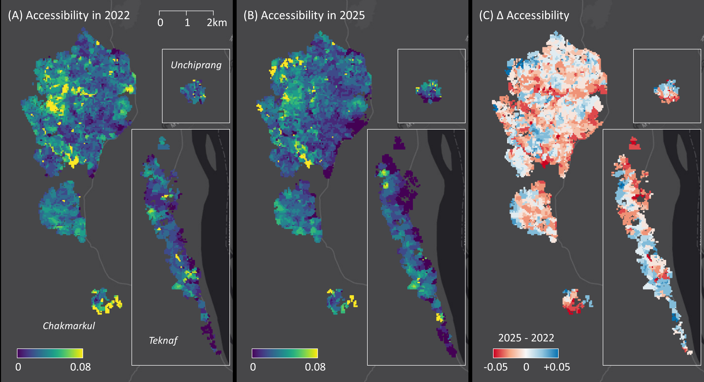

# Mapping WASH Accessibility in Rohingya Camps with Remote Sensing



We detect refugee shelters with remote-sensing–based semi-supervised learning and quantify WASH accessibility using network-distance 2SFCA. We analyze spatiotemporal change and gender gaps.

## Highlights

* Semi-supervised segmentation with SAM-based alignment and pseudo-label refinement
* Shelter mapping across two time points (2022, 2025) using UAV and satellite imagery
* Pedestrian-network–based, 50m $\times$ 50m grid scale 2SFCA accessibility, comparing 2022 vs 2025
* Gender-segregated scenarios (accounting for women’s constraints using all-gender facilities)
* Fully reproducible workflow for code, environment, and outputs

## Repository Layout

```
./
├─ Segmentation/  # Soon to be added
│  ├─ main.py
│  ├─ ...         # data, src, ..., etc.
│  └─ README.md/  # see this file for more information.
├─ Accessibility/
│  ├─ main.R
│  ├─ ...         # data, src, ..., etc.
│  └─ README.md/  # see this file for more information.
└─ README.md
```
